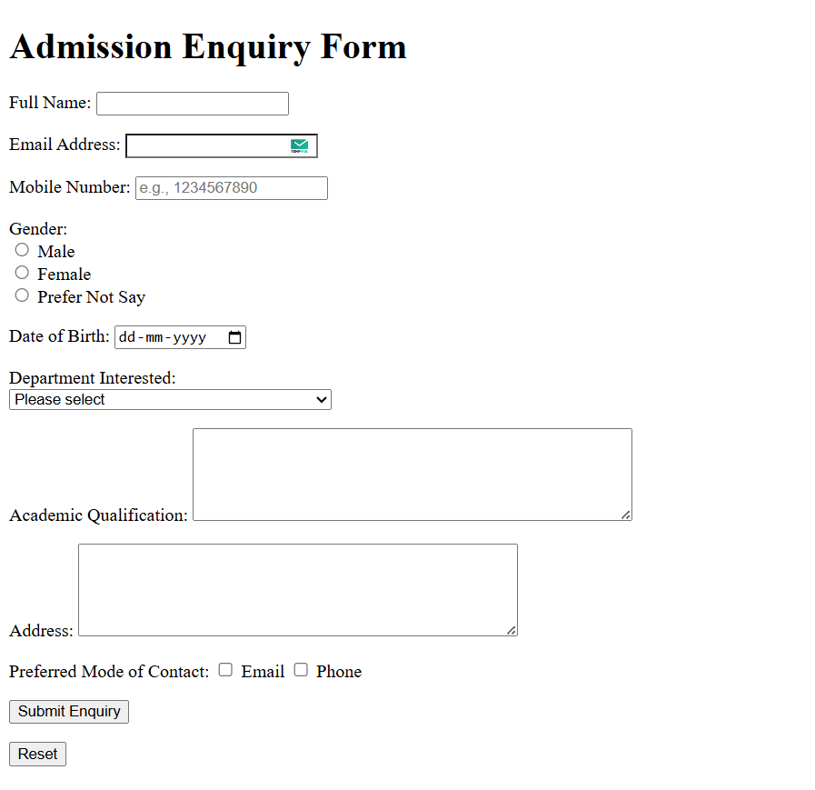

# Admission_Enquiry_Form
## Date: 07-07-2025

## Objective:
To design a simple Admission Enquiry Form using basic HTML that collects student details such as name, contact, program of interest, and a message for further communication.

## Tasks:
#### 1. Set Up the HTML Structure:
Use ```<!DOCTYPE html>```, ```<html>```, ```<head>```, and ```<body>``` tags to define the document structure.
Set the ```<title>``` as "Admission Enquiry Form".

#### 2. Add a Page Heading:
Use ```<h1>``` to title the page as “Admission Enquiry”.

#### 3. Create the Form Layout:
Use the ```<form>``` tag to wrap all input elements. Set method="post" for structure.

#### 4. Add Input Fields:
Include the following fields using appropriate HTML elements:

Full Name

Email Address

Phone Number 

Program of Interest 

Message

#### 5. Add Submit and Reset Buttons:
Use submit and reset at the bottom of the form.

#### 6. Use HTML-only:
No CSS or JavaScript is to be included. Focus on structure and accessibility.

## HTML Code:
```html
<!DOCTYPE html>
<html lang="en">
<!DOCTYPE html>
<html lang="en">
<head>
    <meta charset="UTF-8">
    <meta name="viewport" content="width=device-width, initial-scale=1.0">
    <meta name="discription" conent="Saveetha Engineering College">
    <meta name="keywords" content="Engineering College">
    <meta name="author" content="naveen">
    <title>Saveetha Engineering College - Admission Enquiry</title>
</head>
<body>
    <h1>Admission Enquiry Form</h1>
    <form>
        <p>
            <label for="fullName">Full Name:</label>
            <input type="text" required>
        </p>

        <p>
            <label>Email Address:</label>
            <input type="email"  required>
        </p>

        <p>
            <label>Mobile Number:</label>
            <input type="tel" placeholder="e.g., 1234567890" required>
        </p>

        <p>
            <label>Gender:</label><br>
            <input type="radio">
            <label>Male</label><br>
            <input type="radio">
            <label>Female</label><br>
            <input type="radio">
            <label>Prefer Not Say</label>
        </p>

        <p>
            <label>Date of Birth:</label>
            <input type="date" required>
        </p>

        <p>
            <label>Department Interested:</label><br>
                <select id="departmentInterested" required>
                    <option value="">Please select</option>
                    <option value="CSE">Computer Science Engineering</option>
                    <option value="ECE">Electronics and Communication Engineering</option>
                    <option value="MECH">Mechanical Engineering</option>
                    <option value="EEE">Electrical and Electronics Engineering</option>
                    <option value="CIVIL">Civil Engineering</option>
                    <option value="IT">Information Technology</option>
                    <option value="AI_ML">Artificial Intelligence and Machine Learning</option>
                </select>
        </p>

        <p>
            <label >Academic Qualification:</label>
            <textarea rows="5" cols="50" required></textarea>
        </p>

        <p>
            <label>Address:</label>
            <textarea  rows="5" cols="50" required></textarea>
        </p>

        <p>
            <label>Preferred Mode of Contact:</label>
            <input type="checkbox" value="email">
            <label>Email</label>
            <input type="checkbox" value="phone">
            <label>Phone</label>
        </p>

        <p>
            <input type="submit" value="Submit Enquiry">
        </p>
        <p>
            <input type="reset" value="Reset">
        </p>
    </form>
</body>
</html>
```
## Output:


## Result:
An Admission Enquiry Form using HTML that collects student details and message for institutional follow-up is successfully created using semantic and readable HTML.
